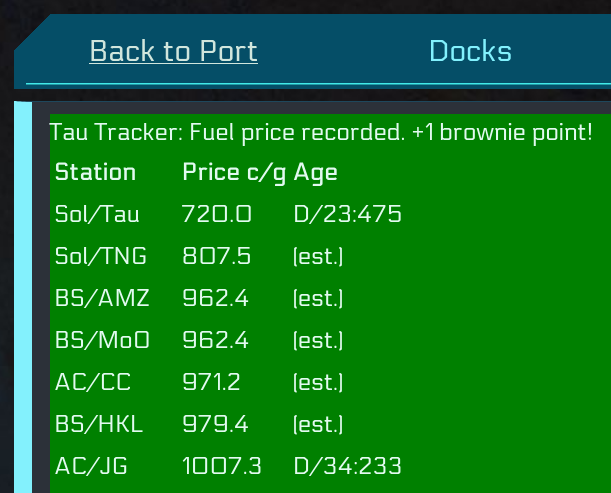

# Universal Tau Tracker

This is a small tool to collect career task data from the [Tau Station
Sci-Fi browser-based MMORPG](https://taustation.space/).

## Purpose

Within Tau Station, there are several variables that change over time, including

* Station distances due to orbital mechanics
* Career task bonus factors
* Fuel prices
* Bodyguards

... and we expect more things in future to change over time.

This tool aims to be an extensible platform to track such things, and give the user helpful feedback where possible.

In general, you get up-to-date information from all contributors, and
historic information [is available on the website.](https://tracker.tauguide.de/)

For example, if you visit your private ship at the Docks, the script automatically submits the current fuel price to the central tracker, and in turn, you get all the fuel prices for the current day that have been reported so far.

### Career Tasks

A [game update in June 2019](https://blog.taustation.space/blog/update-changelog-2019-jun-25/) introduced [variable career task bonuses](https://blog.taustation.space/blog/a-guided-tour-up-the-career-ladder/).

It seems there is a baseline bonus (9 credits for the lowest-paying task of most careers), and an additional factor between 1 and 2 that varies by station and time. The variation is on the order of hours to days.

This repository provides tooling to automatically record career task bonuses
during normal game play, conforming to the [Tau Station Terms of Service](https://taustation.space/terms). In addition, it shows you the factors of other stations within the same system, provided up-to-date data is available.

After an [initial setup](#setup), simply navigate to the [list of career tasks](https://taustation.space/career). A userscript automatically extracts data from this page and submits it to a central server.

The submitted data will be used to gain a better understanding of the career task bonus mechanics. Any general findings will be published in the [Tau Guide](https://tauguide.de/).

[Visualization of past career factor data by system is available](https://tracker.tauguide.de/career).

### Station Distances

Space Stations in Tau Station [orbit a central body](https://tauguide.de/orbital-mechanics).

If you visit the [Local Shuttles page](https://taustation.space/travel/area/local-shuttles), the userscript will automatically record the distances between stations, which helps us to reverse engineer orbital parameters, such as radius and orbital period.

[This page](https://tracker.tauguide.de/distance) visualizes station distances over time.

### Fuel Prices

The [October 2019 update](https://blog.taustation.space/blog/update-changelog-2019-oct-15/) introduced variable fuel prices.
When you visit [the docks](https://taustation.space/area/docks) and have a private ship there (but aren't inside the cockpit),
the userscript automatically records the current station's fuel price per gram, and gives you an overview of current fuel prices.

In addition, a [public page](https://tracker.tauguide.de/fuel) gives an overview of fuel price ranges observed per station.

### Ship Positions

When you visit the Docks (sub-area of the Port) of the local station, the currently present ships are submitted [to the ship registry](https://tracker.tauguide.de/ship/).

## Setup

As a user, you need to follow the following steps to submit data to the career task tracker:

* Install a browser extension that allows you to run userscripts, for example [Tampermonkey](https://www.tampermonkey.net/) or [Greasemonkey](https://www.greasespot.net/).
* Request an access token from [moritz via in-game mail](https://taustation.space/email/write/moritz)
* Install the [`tau_tracker.user.js` userscript](https://github.com/taustation-fan/universal-tau-tracker/raw/master/tau-tracker.user.js).
* Navigate to [Preferences](https://taustation.space/preferences) and enter your access token under *UserScript: Career Task Tracker*.

After this setup, you'll automatically submit career task data when you
view the [list of career tasks](https://taustation.space/career), and shuttle data when you visit [local shuttles](https://taustation.space/travel/area/local-shuttles).

## Development

The server component of the career task tracker is a Python 3.6+ application
built on Flask and the SQLAlchemy ORM.

To create a development environment, you need to have Python 3.6
available, and the `virtualenv` package. Execute the command

    $ ./setup-venv.sh

(once) followed by `source venv/bin/activate` (each time you open a new shell/terminal window). To exit the development environment, use the `deactivate` command.

You will need a local postgresql database named `utt` to run the application locally, and it needs to be accessible for the user you are developing under. If your local account is `dave`, you can create the database by running these commands as the `postgres` user:

    $ createuser dave
    $ createdb --owner dave utt

You can then start the application in development mode with the commands

    $ python createuser.py testuser
    $ python -m utt

The development server uses an sqlite database in `/tmp/test.db`,
and starts on localhost port 5000.

The HTTP API endpoints are documented in [API.md](API.md).
